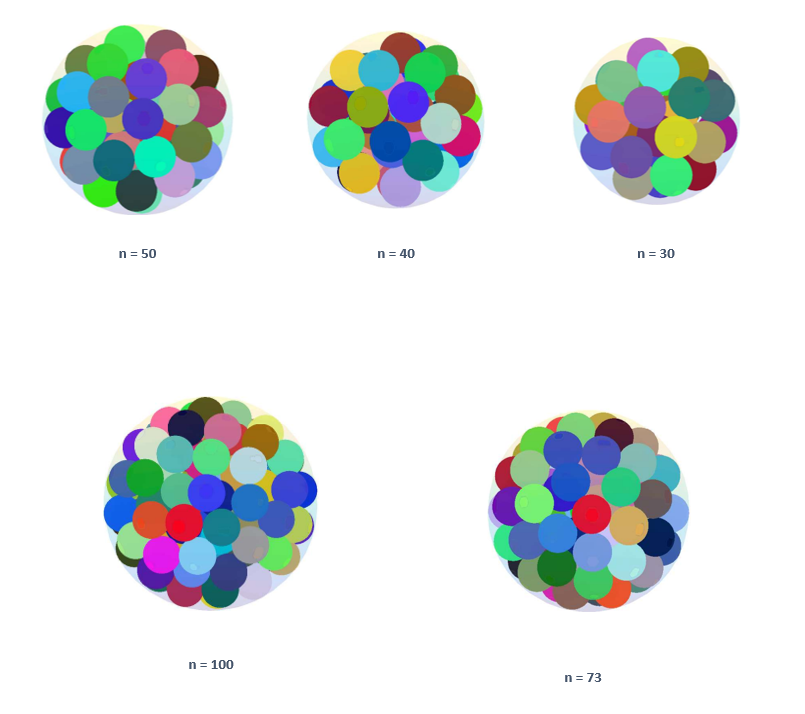

# Sphere Packing Optimization Project



This project reproduces experiments for the paper **"An Efficient Solution Space Exploring Method for Sphere Packing Problem"** (Jianrong Zhou et al.) - [arXiv:2305.10023](https://arxiv.org/abs/2305.10023).

The goal is to find the minimum radius $R$ for a container sphere to enclose $n$ non-overlapping unit spheres (radius $r=1$).

## Course Information
This project was defined for the **Introduction to Optimization** course, under the supervision of **Dr. Kasra Alishahi**.

## Contributors
This project was a joint effort by:
- **Mohammadmohsen Abbaszadeh** ([@HisEgo](https://github.com/HisEgo))
- **Sina Daneshgar**

## Directory Structure
- **`matlab/`**: Original MATLAB implementations.
  - `bfgs_solver.m`: Quasi-Newton (BFGS) method.
  - `gd_solver.m`: Gradient Descent method with Potential Energy Function.
- **`python/`**: Python translations of the algorithms using `numpy` and `matplotlib`.
  - `bfgs_solver.py`: BFGS solver refactored for efficiency.
  - `gd_solver.py`: Gradient Descent solver using analytical gradients.
- **`docs/`**: Documentation and Reports.
  - **`report_fa.tex`**: The complete original report in Persian (LaTeX source).
  - **`report_en.tex`**: English version of the report.
  - **`figs/`**: Shared figures and images used in the reports.
  - **`refs.bib`**: Bibliography file.
  - **`reference_paper.pdf`**: The reference paper by Zhou et al.

## Requirements
- **Python**: Numpy, Matplotlib, Scipy
- **MATLAB**: Core

## How to Run Python Scripts
```bash
python python/gd_solver.py
python python/bfgs_solver.py
```

## Methods
### Gradient Descent
Uses a potential energy function $F(x)$ comprising a repulsive term (Coulomb-like) and a harmonic attraction term to the center:

$$
F(x) = \sum_{i < j} \frac{1}{\Vert x_i - x_j \Vert} + \sum_{i} \Vert x_i \Vert^2
$$

### BFGS (Quasi-Newton)
Minimizes a penalty-based energy function $E(x)$ dealing with overlaps and boundary violations:

$$
E(x) = \sum_{i < j} \max(0, 2 - \| x_i - x_j \|)^2 + \sum_{i} \max(0, \| x_i \| + 1 - R)^2
$$

This approach iteratively optimizes both the sphere positions and the container radius.
